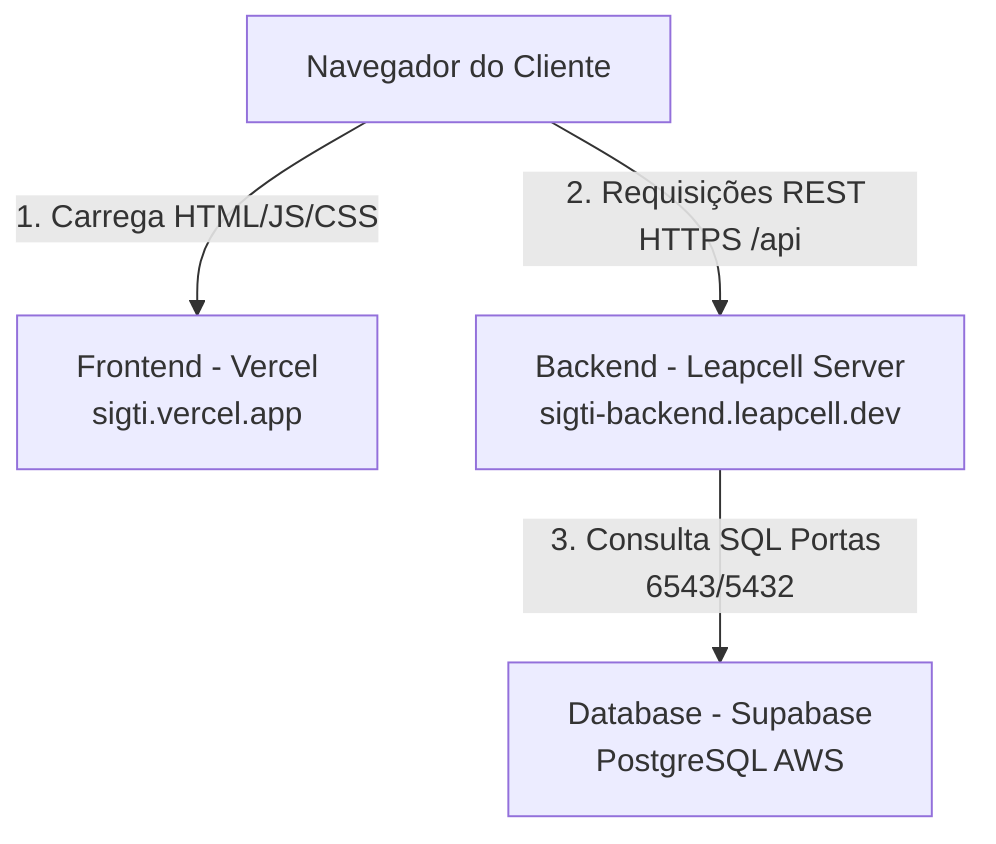

# Plano de Deploy e Análise de Produção (Production-Ready)

Este documento apresenta uma análise detalhada da prontidão para produção (Production-Readiness) da aplicação **SIGTI** e um plano de deploy passo a passo utilizando **Vercel** (para o Frontend), **Leapcell** (para o Backend) e **Supabase** (para o Banco de Dados PostgreSQL).

---

## 🔍 1. Análise de Prontidão para Produção (Production-Ready)

Uma análise rigorosa do estado atual do código e das configurações de ambiente revelou pontos críticos a serem ajustados antes de realizar o deploy. Abaixo estão as análises e as melhorias que já foram aplicadas.

### A. Variáveis de Ambiente e Arquivo `.env`
O arquivo `.env` atual contém dados locais que **nunca** devem ir para produção:
- `DATABASE_URL`: Aponta para um container Docker local (`@postgres:5432`). Em produção, deverá apontar para o pooler ou conexão direta do Supabase.
- `JWT_SECRET`: Está definido como `"minha_chave_super_secreta"`. Em produção, deve ser um hash de alta entropia gerado aleatoriamente (ex: `openssl rand -hex 32`).
- `PORT`: Está fixado em `3001`. Plataformas PaaS como o Leapcell injetam dinamicamente a porta na variável `PORT`. O backend foi verificado e já está tratando corretamente com `process.env.PORT || 3001` no arquivo `index.ts`.
- `CORS_ORIGIN`: Precisa ser restrito ao domínio oficial do frontend na Vercel (ex: `https://sigti.vercel.app`) em vez do padrão de desenvolvimento, para evitar vulnerabilidades de Cross-Origin.
- `VITE_API_URL`: O frontend precisa saber onde enviar requisições de API em produção. 

> [!IMPORTANT]
> **Melhoria Aplicada**: Criamos o arquivo [`.env.example`](file:///home/davi/Documentos/IFAL/PINT/teste-producao/PI/.env.example) na raiz do projeto para servir como referência limpa de todas as variáveis exigidas, com explicações sobre qual tipo de dado preencher em cada ambiente.

---

### B. Correção das Falhas de Compilação TypeScript (Frontend)
Ao rodar testes de compilação estritos no frontend com `npx tsc --noEmit`, identificamos **9 erros de compilação TypeScript** que fariam com que a Vercel e o Leapcell rejeitassem o build e falhassem no deploy:
1. `src/components/TaksModal/index.tsx:554:45`: Erro de tipo onde um valor potencialmente `undefined` (`task.anexo`) estava sendo passado para a função `downloadAttachment` que exige uma `string`.
2. Outros **8 erros** relacionados a imports declarados mas nunca usados (ex: `Skeleton` em diversos gráficos do Dashboard) e parâmetros de map sem uso (`idx` em `CategoryByUnitChart.tsx`), sob a regra estrita de TypeScript `"noUnusedLocals": true` e `"noUnusedParameters": true`.

> [!TIP]
> **Melhorias Aplicadas**:
> - Adicionamos o operador de asserção não-nula `!` em `task.anexo!` no arquivo [`TaksModal/index.tsx`](file:///home/davi/Documentos/IFAL/PINT/teste-producao/PI/frontend/src/components/TaksModal/index.tsx#L554) (uma vez que o bloco já é verificado e garantido pela condicional de renderização).
> - Removemos todos os imports de `Skeleton` e variáveis não utilizadas nos componentes [`ActiveTicketAgeCard.tsx`](file:///home/davi/Documentos/IFAL/PINT/teste-producao/PI/frontend/src/pages/dashboard/components/ActiveTicketAgeCard.tsx), [`AvgTimeByStatusChart.tsx`](file:///home/davi/Documentos/IFAL/PINT/teste-producao/PI/frontend/src/pages/dashboard/components/AvgTimeByStatusChart.tsx), [`CategoryByUnitChart.tsx`](file:///home/davi/Documentos/IFAL/PINT/teste-producao/PI/frontend/src/pages/dashboard/components/CategoryByUnitChart.tsx), [`CategoryTrendChart.tsx`](file:///home/davi/Documentos/IFAL/PINT/teste-producao/PI/frontend/src/pages/dashboard/components/CategoryTrendChart.tsx), [`EquipmentIssuesChart.tsx`](file:///home/davi/Documentos/IFAL/PINT/teste-producao/PI/frontend/src/pages/dashboard/components/EquipmentIssuesChart.tsx) e [`ResolutionByCategoryChart.tsx`](file:///home/davi/Documentos/IFAL/PINT/teste-producao/PI/frontend/src/pages/dashboard/components/ResolutionByCategoryChart.tsx).
> - **Status Atual**: A compilação TypeScript do Frontend e do Backend agora completam com **sucesso absoluto (ZERO erros)**.

---

### C. Integração da API e CORS no Frontend (Vite)
No desenvolvimento local, o frontend se comunica usando a rota relativa `/api`, confiando no proxy do servidor de desenvolvimento Vite (`vite.config.ts`).
Em ambiente de produção na Vercel, o Vite não roda em tempo de execução; a Vercel serve apenas arquivos estáticos (HTML/CSS/JS). Portanto, a rota relativa `/api` causará erros 404 imediatos se o navegador tentar disparar requisições para o próprio domínio da Vercel.

> [!TIP]
> **Melhorias Aplicadas**:
> 1. Atualizamos o arquivo [`api.ts`](file:///home/davi/Documentos/IFAL/PINT/teste-producao/PI/frontend/src/services/api.ts) do frontend para obter dinamicamente a URL base:
>    ```typescript
>    baseURL: (import.meta.env.VITE_API_URL as string | undefined) || '/api',
>    ```
>    Isso permite que você defina a variável `VITE_API_URL` na Vercel apontando para o seu backend no Leapcell.
> 2. Criamos o arquivo [`vercel.json`](file:///home/davi/Documentos/IFAL/PINT/teste-producao/PI/frontend/vercel.json) na raiz do frontend com redirecionamento Single Page Application (SPA):
>    ```json
>    {
>      "cleanUrls": true,
>      "trailingSlash": false,
>      "rewrites": [
>        { "source": "/((?!assets|favicon.ico|vite.svg).*)", "destination": "/index.html" }
>      ]
>    }
>    ```
>    Isso garante que ao atualizar páginas como `/chamados` ou `/dashboard` diretamente no navegador, o usuário não receba um erro 404 da Vercel.

---

### D. Tratamento de Erros e Logs Estruturados
Para a produção, logs do console (`console.log`, `console.error`) são ineficientes e degradam a performance. O backend já possui suporte estruturado do `Pino`.

> [!IMPORTANT]
> **Melhoria Aplicada**: Identificamos e corrigimos o último `console.error` remanescente nas rotas de produção, localizado no tratamento do arquivo de anexo em [`app.ts`](file:///home/davi/Documentos/IFAL/PINT/teste-producao/PI/backend/src/app.ts#L76), substituindo-o pelo logger estruturado `logger.error({ err }, 'Erro ao obter arquivo do arquivo')`.

---

## 🛠️ 2. Arquitetura de Produção Proposta

A imagem abaixo ilustra o fluxo de dados e comunicação da nossa infraestrutura em produção:



---

## 🚀 3. Plano de Deploy Passo a Passo

### 📦 FASE 1: Banco de Dados no Supabase

O Supabase hospedará a nossa base de dados PostgreSQL. Ele fornece alta disponibilidade e backup automáticos.

> [!NOTE]
> **Status:** Esta etapa já foi concluída! As tabelas do banco de dados foram criadas por meio do comando `npx prisma migrate deploy` e populadas com sucesso via `npx prisma db seed` através das connection strings direta (porta `5432`) e de transação (porta `6543`) configuradas no seu arquivo `.env`.

---

### 🖥️ FASE 2: Guia Detalhado de Deploy do Backend no Leapcell

O **Leapcell** é uma plataforma PaaS de alta performance projetada para hospedar microsserviços e APIs com implantação contínua (GitOps). Como o nosso backend está aninhado em um subdiretório do repositório (`PI/backend`), siga estes passos exatos para configurá-lo no painel:

#### Passo 1: Preparação do Repositório (Git)
Certifique-se de realizar o commit e o push de todas as melhorias que realizamos (como a atualização de compatibilidade do `schema.prisma` com `directUrl` e a remoção de consoles remanescentes):
```bash
git add .
git commit -m "chore: preparar aplicacao para producao e deploy"
git push origin sua-branch-principal
```

#### Passo 2: Acessar e Conectar no Leapcell
1. Acesse o site do [Leapcell](https://leapcell.io) e clique em **"Log In"** (Entrar).
2. Escolha **"Sign in with GitHub"** (Entrar com GitHub) para vincular a sua conta de forma direta.
3. Autorize o Leapcell a visualizar seus repositórios do GitHub.

#### Passo 3: Criar o Serviço de Backend
1. No painel inicial do Leapcell, clique no botão azul **"New Service"** (Novo Serviço).
2. Na lista de repositórios, localize e clique sobre o repositório do **SIGTI**.
3. Na tela de configurações do novo serviço, insira as seguintes informações exatas:
   * **Service Name (Nome do Serviço):** `sigti-backend` (ou o nome de sua preferência).
   * **Language/Runtime:** Selecione **Node.js** (não utilize Docker a menos que deseje gerenciar imagens manualmente; a compilação nativa em Node.js é mais rápida).
   * **Root Directory (Diretório Raiz):** Defina como **`PI/backend`**. Isto é de suma importância para que o Leapcell saiba que deve executar os comandos de instalação e build dentro da pasta onde se encontra o `package.json` do backend, e não na raiz geral do repositório.
   * **Build Command (Comando de Compilação):** Insira **`npm install && npm run build`** (ou apenas `npm run build` se a plataforma já rodar a instalação automaticamente. Inserir a linha completa garante segurança em qualquer ambiente).
     > [!NOTE]
     > Como adicionamos `"postinstall": "prisma generate"` nas dependências do backend, o processo de instalação de dependências irá gerar o cliente Prisma automaticamente, e em seguida a pasta compilada `dist/` será criada pelo comando `build`.
   * **Start Command (Comando de Inicialização):** Insira **`npm run start`** (ou `node dist/index.js`).
   * **Port (Porta):** Insira **`3001`**. A API do SIGTI está programada para utilizar `process.env.PORT || 3001`, de modo que o Leapcell conseguirá realizar o mapeamento interno de portas HTTP perfeitamente.

#### Passo 4: Cadastrar as Variáveis de Ambiente (Config)
Abaixo das opções de comandos, clique na aba **"Environment Variables"** (Variáveis de Ambiente) e adicione as seguintes entradas clicando em **"Add Variable"** para cada uma:

* **`DATABASE_URL`**: Cole a Connection String de transação do Supabase (porta `6543`) contendo o parâmetro `?pgbouncer=true`.
* **`DIRECT_URL`**: Cole a Connection String direta do Supabase (porta `5432`) sem pgbouncer.
* **`JWT_SECRET`**: Insira uma string aleatória forte (Ex: `ERrkI4vPkWFHNJkz` ou outra senha de sua escolha) que será utilizada para assinar os tokens dos usuários.
* **`NODE_ENV`**: Defina o valor como **`production`**.
* **`LOG_LEVEL`**: Defina o valor como **`info`** (para manter os logs do Pino enxutos).
* **`CORS_ORIGIN`**: Por enquanto, insira temporariamente `*` ou deixe em branco. **Atualizaremos esta variável no Passo 7** assim que a Vercel gerar a URL oficial do seu frontend.

#### Passo 5: Iniciar o Deploy e Validar
1. Clique em **"Deploy"** no rodapé da página.
2. O Leapcell iniciará a compilação. Você pode acompanhar a saída do terminal de build na aba **"Build Logs"**.
3. Assim que o status mudar para **"Ready"** (Pronto), o Leapcell fornecerá a URL pública HTTPS da sua API, que será parecida com:
   `https://sigti-backend-[seu-usuario].leapcell.dev`
4. **Validação da API:** Para verificar se o servidor está no ar e respondendo corretamente ao banco de dados, abra uma nova aba no seu navegador e acesse o endpoint de saúde que configuramos:
   `https://sigti-backend-[seu-usuario].leapcell.dev/api/health`
   Se a página retornar um JSON como `{ "status": "ok", "timestamp": "..." }`, seu backend está no ar com 100% de sucesso! Copie a URL completa da API.

---

### 🎨 FASE 3: Guia Detalhado de Deploy do Frontend na Vercel

A **Vercel** fará a distribuição estática global ultra-rápida (Edge CDN) do seu frontend React.

#### Passo 1: Acessar a Vercel
1. Vá em [vercel.com](https://vercel.com) e conecte usando sua conta do GitHub.
2. Clique no botão preto **"Add New..."** e selecione a opção **"Project"** (Projeto).

#### Passo 2: Importar o Projeto
1. Na lista de repositórios do GitHub exibida, clique no botão **"Import"** (Importar) ao lado do seu repositório **SIGTI**.

#### Passo 3: Configurar os Parâmetros do Frontend
Na tela de configuração do projeto Vercel, preencha exatamente os campos a seguir:
1. **Project Name:** `sigti` (ou o nome que preferir).
2. **Framework Preset:** Selecione **Vite** (geralmente é auto-detectado).
3. **Root Directory (Diretório Raiz):** Clique no botão **"Edit"** e selecione a pasta **`PI/frontend`**. Isso é crucial para que a Vercel execute o comando de build dentro da pasta correta contendo a aplicação React.
4. **Build and Development Settings:** Deixe os valores padrões pré-configurados pela Vercel (`npm run build` e pasta de saída `dist`).

#### Passo 4: Adicionar a Variável de Ambiente
Abra a seção **"Environment Variables"** e insira a variável que conectará seu frontend com a API hospedada no Leapcell:
* **Key (Chave):** **`VITE_API_URL`**
* **Value (Valor):** Cole a URL de produção gerada pelo Leapcell na Fase 2 **acrescida do sufixo `/api`**.
  * Exemplo: `https://sigti-backend-[seu-usuario].leapcell.dev/api`
  > [!IMPORTANT]
  > Certifique-se de que a URL não tenha uma barra (`/`) no final. O formato correto é terminar com `/api`.

#### Passo 5: Implantar (Deploy)
1. Clique no botão verde **"Deploy"**.
2. A Vercel executará o comando `npm run build` do React. Graças às correções TypeScript que efetuamos em seus componentes e arquivos gráficos, o build finalizará sem nenhum erro!
3. Após alguns segundos, a Vercel exibirá uma tela de comemoração e fornecerá a sua URL pública final de produção (ex: `https://sigti.vercel.app` ou `https://sigti-two.vercel.app`). Copie esta URL do frontend.

---

### 🔗 FASE 4: Amarração Final de Segurança (CORS)

Como uma das melhores práticas de segurança que especificamos na nossa análise de produção, o seu backend não deve aceitar requisições de origens desconhecidas. Agora que seu frontend tem uma URL definitiva, vamos fechar o cadeado de segurança:

1. Volte ao painel do **Leapcell**.
2. Abra as configurações do serviço `sigti-backend` e vá na aba **"Environment Variables"** (ou "Config").
3. Localize a variável **`CORS_ORIGIN`**.
4. Substitua o valor atual pela URL oficial que a Vercel gerou para você (Ex: `https://sigti.vercel.app`).
   > [!WARNING]
   > Não adicione barras ou sufixos no final. Exemplo correto: `https://sigti.vercel.app` (sem `/` no final).
5. Salve as alterações. O Leapcell fará um reinício suave em segundos, atualizando as políticas de CORS para aceitar conexões vindas exclusivamente do seu frontend da Vercel.

---

## 🏁 4. Como testar tudo depois de pronto?

Para testar o fluxo de ponta a ponta:
1. Abre a URL pública gerada pela **Vercel** no seu navegador.
2. Você será direcionado para a tela de login (`/login`).
3. Insira as credenciais padrão criadas pelo nosso seed do Supabase:
   * **Usuário:** `admin`
   * **Senha:** `admin123`
4. Se o login for bem-sucedido, a aplicação React carregará o painel Kanban em `/chamados`, fazendo a chamada segura da API do Leapcell, que por sua vez coletará os dados salvos em nuvem no Supabase.
5. Acesse a aba **Dashboard** para validar se os gráficos estão lendo os tickets históricos e ativos perfeitamente e sem erros no console!
